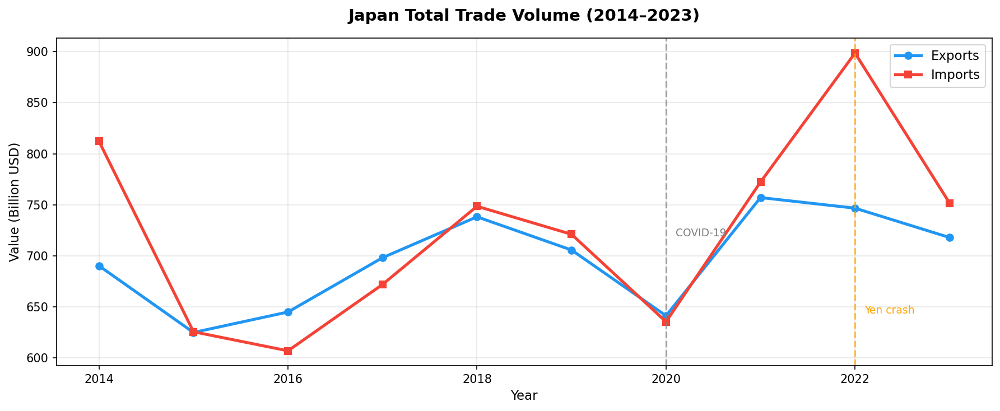

# Japan Trade Intelligence System

*A bilateral trade intelligence system analyzing Japan's economic vulnerabilities, built as preparation for METI IPA 2027.*

---

## Overview

This project analyzes Japan's bilateral trade position using UN Comtrade data across six economies — Japan, China, USA, Germany, South Korea, and the United Kingdom — from 2014 to 2023. It asks one core question: **where is Japan structurally exposed, and what happens if that exposure is tested?** The analysis moves from Japan's recent trade-deficit history, through sector-level dependency and concentration risk, to a forward-looking forecast that is then validated against actual 2024-2025 Ministry of Finance data.

## Why This Project

Most student trade-data projects stop at exploratory charts. This one is built as policy analysis — the kind of question a METI economist would actually ask: not "what does Japan trade?" but "what is Japan's single point of failure, and how much would it cost?" Every notebook is structured around a decision a policymaker could make from it, which is also why the forecast section openly reports where the model was wrong rather than hiding it.

## Key Findings

- Japan's 2022 trade deficit reached **-$152bn** — the worst in the dataset — driven by a 32-year yen low and the global energy price shock occurring simultaneously, exposing Japan's ~90% energy import dependency
- China supplies **22.4%** of Japan's imports ($168bn), more than double the 10% concentration-risk threshold, with an HHI score of 827 that *understates* the real risk since 200+ of Japan's 220 trade partners each contribute under 1%
- A simulated 30% cut to Chinese imports actually *improves* Japan's trade balance to **+$16.6bn** — a disruption paradox, since a healthier balance during a supply shock reflects an inability to buy what's needed, not economic strength
- The linear forecast model projected a **-$47.8bn** deficit for 2024; actual Ministry of Finance data came in at **-$36bn** — validating the model against real government data exposed its blind spots (a semiconductor export surge and stronger hybrid-vehicle demand) instead of just reporting in-sample fit

## Project Structure

```
japan-trade-intelligence/
├── data/
│   ├── raw/                    # Original UN Comtrade downloads (unmodified)
│   └── processed/               # Cleaned master_trade.csv
├── notebooks/
│   ├── 01_eda.ipynb             # Japan's own trade story
│   ├── 02_comparative.ipynb     # 6-country comparison + yen analysis
│   ├── 03_sector.ipynb          # Sector-level trade breakdown
│   ├── 04_risk.ipynb            # Dependency risk + HHI + disruption scenario
│   └── 05_forecast.ipynb        # Rolling averages + linear forecast
├── reports/
│   ├── executive_summary.md     # Policy brief — start here
│   └── *.png                    # All saved charts
├── requirements.txt
└── README.md
```

## How to Run

1. **Clone the repository**
   ```bash
   git clone https://github.com/Prashant-4527/japan-trade-intelligence.git
   cd japan-trade-intelligence
   ```

2. **Install dependencies**
   ```bash
   pip install -r requirements.txt
   ```

3. **Get a free FRED API key** (required for yen analysis in notebook 02)
   - Register at https://fred.stlouisfed.org/docs/api/api_key.html
   - Set it as an environment variable rather than pasting it into the notebook:
     ```bash
     export FRED_API_KEY='your_key_here'
     ```

4. **Run notebooks in order:** `01 → 02 → 03 → 04 → 05`
   Each notebook reads from `data/processed/master_trade.csv`, produced by notebook 01.

5. **Read `reports/executive_summary.md`** for the full policy analysis.

## Data Source

- **UN Comtrade Database** — official United Nations bilateral trade statistics, the same source used by the IMF and World Bank. https://comtradeplus.un.org
- **FRED (Federal Reserve Bank of St. Louis)** — USD/JPY exchange rate data. https://fred.stlouisfed.org
- **Coverage:** Japan, China, USA, Germany, South Korea, United Kingdom | 2014–2023

## Methodology Highlights

- **HHI concentration score calculated from scratch** rather than pulled from a library, to quantify exactly how exposed Japan is to losing any single trading partner.
- **Multi-scenario disruption simulation** (10% / 20% / 30% / 50% cuts to Chinese imports) tracking trade balance *and* GDP impact together — this is what surfaced the disruption paradox finding.
- **Forecast validated post-hoc against real Ministry of Finance data** instead of just reporting model fit — the gap between predicted and actual deficits is documented openly as a finding in itself, not smoothed over.

## Future Improvements (v2 Roadmap)

- Replace the linear forecast with **XGBoost**, addressing the 2024-2025 miss documented in this version
- Add **SHAP explainability** so forecast drivers are interpretable for policy use, not just predictive
- **sklearn clustering** of trade partners by structural trade-relationship similarity
- Wrap the dependency-risk and forecast outputs in a **FastAPI** service instead of static notebooks

## Author

**Prashant** ([@Prashant-4527](https://github.com/Prashant-4527))
BCA student, Maharaja Government College, Jaipur — building toward METI IPA 2027.
